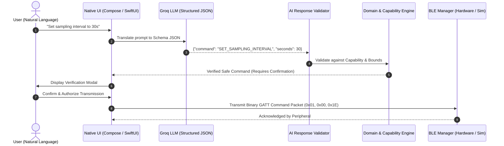

# 🌐 Nexora

<p align="center">
  <strong>Connect. Monitor. Understand.</strong>
  <br />
  <em>A production-grade, open-source Kotlin Multiplatform (KMP) IoT & connected-device platform featuring Native Jetpack Compose (Material 3), Native SwiftUI, CoreBluetooth, Dual-Engine BLE Hardware & Simulator, Local Anomaly Detection, and Safe Groq AI Integration.</em>
</p>

<p align="center">
  
  
  
  
  
  
  
</p>

---

## 📖 Overview

**Nexora** is a reference-grade cross-platform IoT platform engineered to demonstrate modern Senior/Staff mobile architecture. It showcases how Kotlin Multiplatform can share 100% of business logic, domain models, state machines, telemetry processing pipelines, anomaly detection, command validation rules, and AI abstractions while preserving **100% native platform UI** (Jetpack Compose on Android, SwiftUI on iOS).

### 🌟 Key Highlights

- 🧩 **100% Shared KMP Domain**: Clean Architecture use cases, deterministic state machines, binary telemetry packet parsers, and command safety validators live in `commonMain`.
- 📱 **Pure Native User Experiences**: Zero Compose Multiplatform UI compromise — native Material 3 theme on Android, native SwiftUI & Charts on iOS.
- 📡 **Dual-Engine BLE Support**:
  - **Physical Hardware**: Android `BluetoothGatt` & Classic Discovery (discovering IoT beacons, sensor nodes, and Bluetooth devices like Samsung Galaxy smartphones), iOS `CoreBluetooth` (`CBCentralManager`).
  - **Zero-Hardware Simulator**: 7 deterministic test scenarios covering edge cases (low battery, high temperature, RF packet loss, unstable links).
- 📈 **Real-Time Telemetry & Health Engine**: Live streaming of temperature, humidity, pressure, battery, and RSSI with real-time statistical anomaly detection.
- 🛡️ **Safe Groq AI Gateway**: Natural language voice/text commands translated into structured JSON, validated against device capabilities and connection state, requiring mandatory human confirmation before reaching hardware.
- ⚡ **Offline-First & Zero Hosting**: Operates 100% locally out of the box. Zero cloud subscriptions, zero cloud hosting, and zero physical hardware required to run full end-to-end tests.
- 🔌 **Optional Local Ktor Server**: Lightweight local REST & WebSocket backend for telemetry streaming and synchronization demonstrations.

---

## 🏗️ Architecture

```mermaid
graph TD
    subgraph KMP_Core ["Shared Kotlin Multiplatform Layer (sharedLogic)"]
        Domain[Domain Models & Clean UseCases]
        StateMachine[BLE Connection State Machine]
        TelemetryEngine[Telemetry Pipeline & Binary Packet Parser]
        AnomalyEngine[Deterministic Local Anomaly Detector]
        HealthEngine[Device Health Calculator]
        SafetyValidator[Command & AI Safety Validator]
        BleSimulator[BleDeviceSimulator - 7 Scenarios]
        AiService[Safe Groq AI Gateway]
        FlowBridge[Swift Flow Adapter & MVI Contracts]
    end

    subgraph Android_Platform ["Android Application (androidApp)"]
        ComposeUI[Jetpack Compose Material 3 UI]
        AndroidBle[AndroidBleManager - BluetoothGatt + Classic Discovery]
        AndroidStore[Local Persistence & Repositories]
    end

    subgraph iOS_Platform ["iOS Application (iosApp)"]
        SwiftUI[Native SwiftUI Views & Gauges]
        CoreBluetooth[CoreBluetoothManager - CBCentralManager]
        SwiftVM[Observable Object ViewModels]
    end

    subgraph Local_Backend ["Optional Local Backend (backend)"]
        KtorServer[Local Ktor REST & WebSocket Server]
    end

    Domain --> ComposeUI
    Domain --> SwiftUI
    BleSimulator --> AndroidBle
    BleSimulator --> CoreBluetooth
    FlowBridge --> SwiftVM
    AiService --> ComposeUI
    AiService --> SwiftUI
    TelemetryEngine --> KtorServer
```



---

## 📂 Project Structure

```
Nexora/
├── androidApp/          # Native Android App (Jetpack Compose, Material 3, Dark Theme)
│   └── src/main/kotlin/com/yodgorbek/nexora/
│       ├── ui/screens/  # Home, Devices, Telemetry, Insights (AI), Diagnostics, Settings
│       └── ui/theme/    # Nexora Dark Futuristic Theme
├── iosApp/              # Native iOS App (SwiftUI, Charts, CoreBluetooth)
│   └── iosApp/
├── sharedLogic/         # Shared Kotlin Multiplatform Core (KMP)
│   ├── commonMain/      # Domain models, UseCases, MVI, BLE interfaces, AI Gateway
│   ├── androidMain/     # AndroidBleManager (BluetoothGatt + Discovery + Permissions)
│   └── iosMain/         # Swift / iOS interoperability bridges
├── backend/             # Optional local Ktor server (REST & WebSockets)
└── docs/                # Architecture, GATT specs, and guides
```

---

## 🔬 Deterministic BLE Simulator Matrix

Recruiters and engineers can test every edge case without physical BLE hardware:

| Scenario | Device Identifier | Simulated Condition | Automated Behavior |
| :--- | :--- | :--- | :--- |
| **Normal Node** | `SIM-NX-NORMAL-01` | Optimal operating baseline | Steady 22.5°C, 45% RH, -58 dBm, healthy battery |
| **Low Battery** | `SIM-NX-LOWBATT-02` | Critical battery drain | Rapid discharge (<15%) triggering battery warnings |
| **Weak Signal** | `SIM-NX-WEAKSIG-03` | Fringe RF coverage | RSSI -102 dBm with 35% simulated packet loss |
| **Unstable Link** | `SIM-NX-UNSTABLE-04` | Spontaneous disconnects | Periodic link drops testing exponential backoff reconnect |
| **High Temp** | `SIM-NX-HIGHTEMP-05` | Thermal runaway | Temperature climbs to 82°C triggering anomaly engine |
| **Timeout Node** | `SIM-NX-DISCONN-06` | Unreachable endpoint | Rejects handshakes to test timeout recovery |
| **Packet Loss** | `SIM-NX-PKTLOSS-07` | Corrupted byte stream | Emits malformed frames to verify CRC & packet recovery |

---

## 🤖 Safe AI Command & Diagnostic Pipeline

Nexora enforces strict security boundaries around LLMs. AI models are **never** given direct access to Bluetooth sockets, databases, or device peripherals.



---

## 🚀 Getting Started

### 1. Clone the Repository
```bash
git clone https://github.com/YodgorbekKomilov/Nexora.git
cd Nexora
```

### 2. Configure Local Properties (Optional)
Copy the example template and optionally add your Groq API key:
```bash
cp local.properties.example local.properties
```
*Note: `local.properties` is strictly ignored by Git and will never be committed.*

### 3. Build & Run Android Application
```bash
# Assemble Debug APK
./gradlew assembleDebug

# Or install directly on connected Android device/emulator
./gradlew :androidApp:installDebug
```

### 4. Build & Run iOS Application
Open `iosApp/iosApp.xcodeproj` in Xcode and press `Cmd + R` on any iOS Simulator or physical iPhone.

### 5. Run Test Suite
```bash
# Run unit tests across shared logic & Android
./gradlew test
```

### 6. Run Optional Local Ktor Backend
```bash
./gradlew :backend:run
```
The server will start at `http://localhost:8080` (accessible from Android Emulator at `http://10.0.2.2:8080`).

---

## 🧑‍💻 Author

**Yodgorbek Komilov**  
- GitHub: [@YodgorbekKomilov](https://github.com/YodgorbekKomilov)

---

## 📄 License

```
Copyright 2026 Yodgorbek Komilov

Licensed under the Apache License, Version 2.0 (the "License");
you may not use this file except in compliance with the License.
You may obtain a copy of the License at

    http://www.apache.org/licenses/LICENSE-2.0

Unless required by applicable law or agreed to in writing, software
distributed under the License is distributed on an "AS IS" BASIS,
WITHOUT WARRANTIES OR CONDITIONS OF ANY KIND, either express or implied.
See the License for the specific language governing permissions and
limitations under the License.
```