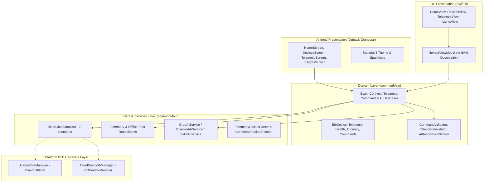

# 🏛️ Nexora Architecture & Technical Design Document

This document details the architectural decisions, design patterns, and engineering principles used in **Nexora**.

---

## 1. High-Level Architecture Overview

Nexora follows **Clean Architecture** and **MVI (Model-View-Intent)** principles with strict layer boundaries.

---

## 2. Kotlin Multiplatform Code Distribution

| Layer | Location | Shared vs Platform | Purpose |
| :--- | :--- | :--- | :--- |
| **Domain Models** | `sharedLogic/src/commonMain/domain/model/` | **100% Shared** | Immutable data contracts, state representations, capability flags |
| **Use Cases** | `sharedLogic/src/commonMain/domain/usecase/` | **100% Shared** | Single-responsibility business actions |
| **Validation** | `sharedLogic/src/commonMain/domain/validation/` | **100% Shared** | Safety boundaries, schema checks, parameter bounds |
| **GATT Protocol** | `sharedLogic/src/commonMain/ble/protocol/` | **100% Shared** | Binary packet parsing, byte encoding, GATT UUIDs |
| **BLE Simulator** | `sharedLogic/src/commonMain/ble/simulator/` | **100% Shared** | 7 deterministic hardware condition profiles |
| **Local Anomaly Engine** | `sharedLogic/src/commonMain/analytics/` | **100% Shared** | Offline heuristic & statistical outlier analysis |
| **Safe Groq AI** | `sharedLogic/src/commonMain/ai/` | **100% Shared** | Structured JSON client, prompt builder, safety fallback |
| **Swift Bridge** | `sharedLogic/src/commonMain/bridge/` | **100% Shared** | `CommonFlow` and `Cancellable` Swift wrappers |
| **Android BLE** | `sharedLogic/src/androidMain/ble/` | **Android** | `BluetoothGatt`, permissions, and lifecycle |
| **iOS BLE** | `iosApp/iosApp/CoreBluetoothManager.swift` | **iOS** | `CBCentralManager` and `CBPeripheralDelegate` |
| **Android UI** | `androidApp/src/main/` | **Android** | Native Jetpack Compose + Material 3 |
| **iOS UI** | `iosApp/iosApp/` | **iOS** | Native SwiftUI Views & Charts |
| **Local Backend** | `backend/src/main/` | **JVM** | Optional local Ktor REST & WebSocket server |

---

## 3. Deterministic Local Anomaly Engine

Nexora operates **100% offline** without requiring AI for core anomaly detection.

### Mathematical Heuristics:
1. **Thermal Runaway:**
   $$\text{Temp} \ge 70.0^\circ\text{C} \implies \text{CRITICAL}, \quad \text{Temp} \ge 50.0^\circ\text{C} \implies \text{WARNING}$$
2. **Battery Discharge Velocity:**
   $$\Delta \text{Batt} \ge 6\% \quad \text{across} \le 10 \text{ samples} \implies \text{RAPID\_BATTERY\_DRAIN}$$
3. **RF Link Degradation:**
   $$\text{RSSI} \le -95\,\text{dBm} \implies \text{WEAK\_SIGNAL}$$
4. **Health Composite Score:**
   $$\text{Score} = 0.25 \times \text{Battery} + 0.25 \times \text{SignalQuality} + 0.50 \times \text{Stability}$$

---

## 4. Safe AI Command Pipeline & Zero Direct Control

To prevent hallucinated LLM actions from harming hardware:
- **No Direct Hardware Access:** Groq models never access `BluetoothGatt`, `CBCentralManager`, or system sockets.
- **Strict Schema Deserialization:** Raw JSON is decoded into a strict schema. Any unrecognized property or opcode maps to `RawCommandType.UNKNOWN`.
- **Capability & State Verification:** The command is verified against `DeviceCapabilities` and the device must be in `ConnectionState.Connected`.
- **Mandatory User Confirmation:** The user must explicitly approve the previewed command before binary bytes are written to the BLE socket.

---

## 5. Offline-First & Zero Hosting Principle

- **Zero Cloud Accounts Required:** Clone the repository and run immediately.
- **Deterministic Simulator:** 7 built-in scenarios enable automated testing and live demonstrations on physical hardware or simulators without BLE peripherals.
- **Optional Local Backend:** The Ktor server runs locally (`localhost:8080` / `10.0.2.2:8080`) for local sync and WebSocket demonstrations without cloud costs.
